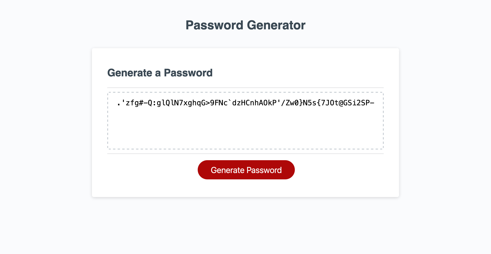

# 03 JavaScript: Password Generator

https://anguswaffle.github.io/passwordGenerator/

## Functionality
User is brought to a page with a button that says "Generate Password"
Through a series of prompts, the user chooses password criteria and is eventually rewarded with a password guaranteed to frustrate all but the most dedicated of super computers.

## Mock-Up
The following image shows the web application's appearance and functionality:

